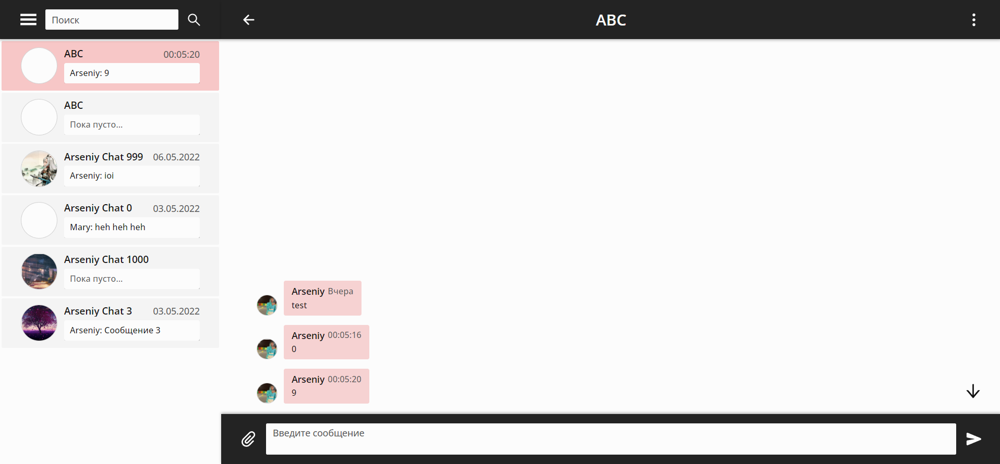

# GraphQL Messenger

Real-time web-messenger based on Node.js, React and GraphQL
(with Apollo platform).



You may try app, deployed on Heroku, [here](https://graphql-messenger-client.herokuapp.com/).

## How to run locally?

#### Clone the project from GitHub

```shell
git clone https://github.com/AshedFox/graphql-messenger
```

#### Move to project directory

```shell
cd ./graphql-messenger
```

#### Install dependencies

```shell
npm install
```

#### Add environment variables: 
- for server (more info [here](./server/README.md))
- for client (more info [here](./client/README.md))

#### Start server

```shell
npm run start:server
```

#### Start client
```shell
npm run start:client
```
